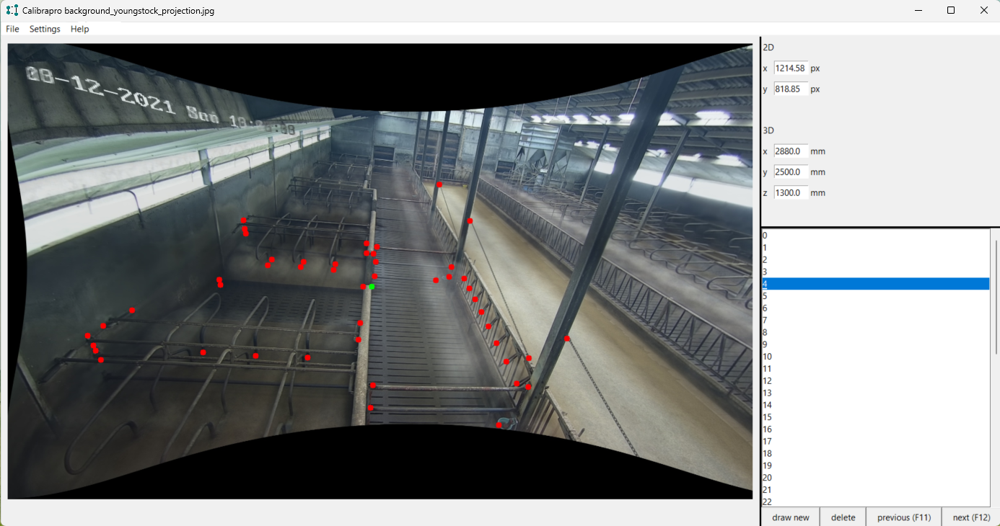

# Calibradisto
Calibrapro

CALIBRAtion of PROjection

Calibrapro is software to associate points on an image with their real-world 3D coordinates. Within the CoBRA project (Cow Behaviour Recording and Analysis), these associations are used to determine the parameters of a projection model which is able to determine the real-world coordinates of a point on an image, given its real world height.

For every annotated image, a .json file is created containing the real-world and image coordinates of all annotated points.

Calibrapro can be run from the calibrapro.py file, but can also be compiled to an executable file using pyinstaller in combination with the compilation parameters specified in calibrapro.spec

